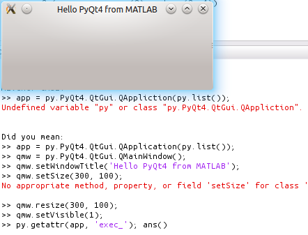

# pybox

This is another toolbox providing access to Python from MATLAB, with the
goals of building on MATLAB's new support for Python.

## Get started

[Download!](https://github.com/maedoc/pybox/archive/master.zip) and put
the folder on your MATLAB path.

Now, setup the Python installation:
```matlab
>>> pybox install_conda  % setup conda installation (dl if needed)
... 
```

and install some packages

```matlab
>>> pybox install numpy scipy pyqt % install some packages
... 
```

Finally, to tell MATLAB to use this Python

```matlab
>>> pybox use               % tell MATLAB to use our python install
>>> py.sys.executable

ans = 

  Python str with no properties.

    /home/duke/MATLAB/pybox/conda/bin/python

```

## Examples

Make array of random numbers

```matlab
>>> py.numpy.random.rand(3)

ans = 

  Python ndarray with properties:

           T: [1x1 py.numpy.ndarray]
...
      nbytes: 24
        ndim: 1
        real: [1x1 py.numpy.ndarray]
       shape: [1x1 py.tuple]
        size: 3
     strides: [1x1 py.tuple]

    [ 0.32473666  0.59561982  0.77702851]

```

MATLAB automatically exposes most stuff on Python objects in the console
and the variable inspector, but it's useful to have the results as a MATLAB
array:

```matlab
>>> np2m(py.numpy.arange(8).reshape(2, 4))

ans =

     0     4
     1     5
     2     6
     3     7
```

Shapes are handled correctly.

Usuability is not bad, see how MATLAB even can make intelligent corrections
(here I misspelled `QApplication`)



## Credits

Miniconda from Continuum is used for setting up environments with prebuilt
packages, in cross platform fashion (or at least as much as conda is) 
especially onerous for scientific libraries.

